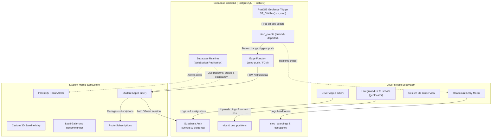

# Multi-Agent Campus Transport Management System (MACTMS) 🚍🎓🤖

An end-to-end **multi-agent** college bus tracking, passenger telemetry, and transit intelligence platform. The system comprises **five autonomous runtime agents** and a **five-agent AI development team** (defined in `opencode.json`), all collaborating through a shared Supabase (PostgreSQL + PostGIS + Realtime + Edge Functions) and CesiumJS 3D backbone.

---

## 🤖 Multi-Agent Architecture

The name **"Multi-Agent"** reflects two distinct layers of agents in this project:

### Layer 1 — Development-Time AI Agents (`opencode.json`)

This project was built using [OpenCode](https://opencode.ai), an AI multi-agent development framework. Rather than a single AI writing all the code, a **team of specialized LLM agents** was orchestrated, each with a distinct expertise:

| Agent | Mode | Model | Responsibility |
|---|---|---|---|
| `architect` | Primary | `nemotron-3-ultra` | Designs architecture, orchestrates all other agents, writes high-level specs |
| `builder` | Subagent | `mimo-v2.5` | Implements Flutter/Dart code, SQL schemas, and pubspec configs |
| `researcher` | Subagent | `deepseek-v4-flash` | Researches PostGIS APIs, Supabase Realtime, CesiumJS, Flutter plugins |
| `debugger` | Subagent | `nemotron-3.5-lightning` | Traces runtime issues, validates trigger logic, and tests edge cases |
| `reviewer` | Subagent | `gpt-oss:120b` | Independent senior code review for security, correctness, and maintainability |

### Layer 2 — Runtime Autonomous Agents (Deployed System)

Once deployed, the system operates as **five autonomous, decoupled agents** that communicate exclusively through database state changes — no agent calls another directly:

| # | Agent | Where it Lives | What Triggers It | What It Does |
|---|---|---|---|---|
| 1 | **Telemetry Agent** | `driver_app/` | Human driver taps *Start Trip* | Streams high-frequency GPS coordinates to `bus_positions` every 10 metres |
| 2 | **Geofence Detection Agent** | `geofence_trigger.sql` (PostGIS) | Every row upserted into `bus_positions` | Runs `ST_DWithin()` against all route stops, fires `arrived`/`departed` events, computes on-time/late status |
| 3 | **Occupancy Tracking Agent** | `occupancy_trigger.sql` (PL/pgSQL) | Every row inserted into `stop_boardings` | Auto-increments `trips.current_occupancy` — zero app-side logic |
| 4 | **Notification Dispatch Agent** | `notification_setup.sql` + `send-push` Edge Function | Every `trips.running_status` change | Queries subscribed students' FCM tokens, calls Deno Edge Function, dispatches Firebase push notifications |
| 5 | **Visualization & Intelligence Agent** | `student_app/` | Supabase Realtime WebSocket events | Renders live 3D Cesium map, computes occupancy load-balancing suggestions, displays proximity arrival alerts |

### How agents communicate — shared event bus

```mermaid
flowchart LR
    TA["1 Telemetry Agent\nDriver App"] -->|upserts GPS coords| BP[(bus_positions)]
    BP -->|PostgreSQL row trigger| GDA["2 Geofence Detection Agent\nPL/pgSQL + PostGIS"]
    GDA -->|inserts arrived or departed| SE[(stop_events)]
    GDA -->|updates running_status| TR[(trips)]

    SE -->|Realtime broadcast| DA["Driver App\nHeadcount Modal"]
    DA -->|inserts boarding count| SB[(stop_boardings)]
    SB -->|PostgreSQL row trigger| OTA["3 Occupancy Tracking Agent\nPL/pgSQL"]
    OTA -->|increments current_occupancy| TR

    TR -->|PostgreSQL row trigger| NDA["4 Notification Dispatch Agent\nPL/pgSQL + Edge Function"]
    NDA -->|FCM HTTP v1 API| Push["Student Devices\nPush Notifications"]

    TR -->|Realtime WebSocket| VIA["5 Visualization Agent\nStudent App"]
    BP -->|Realtime WebSocket| VIA
    SE -->|Realtime WebSocket| VIA
```



> **Why is this called multi-agent?** Each agent is **reactive and decoupled** — the Telemetry Agent doesn't know the Geofence Agent exists; it only writes rows. The Geofence Agent doesn't know the Notification Agent exists; it only updates a column. This event-driven autonomy with no direct inter-agent coupling is the defining property of a multi-agent system.

---

## 🏛 System Architecture




---

## 📱 Sub-Applications

| Application | Directory | Target Users | Key Capabilities |
|---|---|---|---|
| **Driver App** | [`driver_app/`](file:///c:/Users/neil-/Projects/FOAI-Project/driver_app) | Bus Drivers | Background GPS broadcast, ongoing foreground notification, route stop visualization, automated PostGIS geofence arrival detection, and boarding headcount numpad. |
| **Student App** | [`student_app/`](file:///c:/Users/neil-/Projects/FOAI-Project/student_app) | Students & Staff | Realtime 3D Cesium satellite map, zero-polling bus tracking, live occupancy percentages, smart load-balancing transfer suggestions, route timeline, and arrival alerts. |

---

## 🗃 Backend Database & SQL Modules

All schema definitions, PostGIS spatial queries, and triggers are located in the repository root:

- **[`schema.sql`](file:///c:/Users/neil-/Projects/FOAI-Project/schema.sql)**: Core data schema including PostGIS extension setup, `users`, `routes`, `stops`, `buses`, `driver_bus_assignments`, `trips`, `stop_boardings`, `location_pings`, `bus_positions`, `stop_events`, and Row Level Security (RLS) policies.
- **[`geofence_trigger.sql`](file:///c:/Users/neil-/Projects/FOAI-Project/geofence_trigger.sql)**: PL/pgSQL function `handle_bus_position_update()` attached to `bus_positions`. Executes `ST_DWithin` geodetic distance checks in meters against route stops, automatically inserting `arrived`/`departed` events into `stop_events` and computing delay metrics (`on_time`, `late`, `arrived`).
- **[`occupancy_trigger.sql`](file:///c:/Users/neil-/Projects/FOAI-Project/occupancy_trigger.sql)**: Automatically increments `trips.current_occupancy` whenever drivers submit new entries into `stop_boardings`.
- **[`notification_setup.sql`](file:///c:/Users/neil-/Projects/FOAI-Project/notification_setup.sql)**: Push notification infrastructure defining `user_devices` (FCM tokens), `route_subscriptions`, and a trigger that invokes the `send-push` Edge Function when bus status changes.
- **[`seed_data.sql`](file:///c:/Users/neil-/Projects/FOAI-Project/seed_data.sql)**: Sample routes, stops, and buses for Bangalore transit corridors (Route A - Electronic City, Route B - Whitefield, Route C - Koramangala).
- **[`update_schema.sql`](file:///c:/Users/neil-/Projects/FOAI-Project/update_schema.sql)**: Enables Supabase Realtime publication for `bus_positions`, `trips`, `stop_events`, and `stops`.
- **[`fix_rls.sql`](file:///c:/Users/neil-/Projects/FOAI-Project/fix_rls.sql)** & **[`fix_student_role.sql`](file:///c:/Users/neil-/Projects/FOAI-Project/fix_student_role.sql)**: Patches for driver bus assignment upserts and student role validation.

---

## ⚡ Edge Functions

- **[`supabase/functions/send-push/`](file:///c:/Users/neil-/Projects/FOAI-Project/supabase/functions/send-push)**: Deno TypeScript edge function that exchanges service account credentials for Google OAuth2 tokens and dispatches Firebase Cloud Messaging (FCM) push notifications to subscribed students.

---

## 🛠 Quick Start Guide

### 1. Backend Setup (Supabase)
1. Create a Supabase project at [supabase.com](https://supabase.com).
2. In the Supabase SQL Editor, execute the following SQL scripts in order:
   - `schema.sql`
   - `geofence_trigger.sql`
   - `occupancy_trigger.sql`
   - `notification_setup.sql`
   - `update_schema.sql`
   - `fix_rls.sql`
   - `fix_student_role.sql`
   - `seed_data.sql`
3. Retrieve your **Project URL** and **Anon Public Key** from Project Settings > API.

### 2. Configure Environment Variables
Create a `.env` file inside both `driver_app/` and `student_app/`:

```env
Api_url=https://YOUR_SUPABASE_PROJECT_ID.supabase.co
Anon_key=YOUR_SUPABASE_ANON_KEY
CESIUM_ION_ACCESS_TOKEN=YOUR_OPTIONAL_CESIUM_ION_ACCESS_TOKEN
```

### 3. Running the Driver App
```bash
cd driver_app
flutter pub get
flutter run
```
*Read full documentation at [`driver_app/README.md`](file:///c:/Users/neil-/Projects/FOAI-Project/driver_app/README.md).*

### 4. Running the Student App
```bash
cd student_app
flutter pub get
flutter run
```
*Read full documentation at [`student_app/README.md`](file:///c:/Users/neil-/Projects/FOAI-Project/student_app/README.md).*
