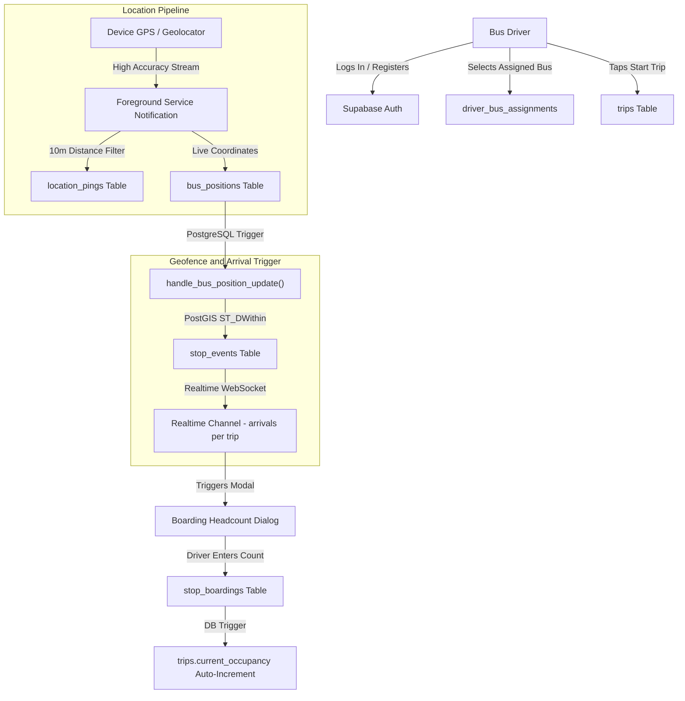

# College Bus Driver App 🚌

A real-time driver telemetry, route navigation, and passenger headcount logging application built with **Flutter**, **Supabase**, and **CesiumJS 3D**. 

This app serves as the operational mobile interface for college bus drivers, allowing them to broadcast high-frequency GPS tracking data, navigate assigned routes, automatically detect stop arrivals via PostGIS geofencing, and record student boardings.

---

## 📋 Table of Contents
- [Overview & Architecture](#-overview--architecture)
- [Key Features](#-key-features)
- [Tech Stack & Dependencies](#-tech-stack--dependencies)
- [Database & Backend Integration](#-database--backend-integration)
- [Android Configuration & Permissions](#-android-configuration--permissions)
- [Environment Variables](#-environment-variables)
- [Getting Started & Installation](#-getting-started--installation)
- [Application Flow & Usage](#-application-flow--usage)

---

## 🌐 Overview & Architecture

The Driver App is designed for high reliability, accurate background location tracking, and simple one-handed operation while driving. 



---

## ✨ Key Features

1. **Driver Authentication & Fleet Assignment**:
   - Secure driver registration and sign-in via Supabase Auth.
   - Profile verification in the `users` table (`role = 'driver'`).
   - Self-assignment to physical buses (`driver_bus_assignments` mapped to `buses.bus_number`).
   - Persistent session caching and session recovery in `AuthGate`.

2. **Persistent Foreground GPS Telemetry**:
   - Continuous location tracking using `geolocator` with high accuracy and a 10-meter distance filter.
   - Ongoing Android foreground service notification (`flutter_local_notifications`), preventing the OS from terminating GPS tracking when the app is minimized or the screen locks.
   - Real-time updates pushed concurrently to `location_pings` (historical breadcrumbs) and `bus_positions` (latest coordinates).

3. **PostGIS Geofenced Arrival Detection**:
   - Automatic stop detection powered by PostGIS database triggers (`ST_DWithin` against stop coordinates and radius).
   - Arrival events inserted into `stop_events` calculate delay thresholds and update trip status (`on_time`, `late`, `arrived`).
   - Client listens to Supabase Realtime channel `arrivals:<trip_id>` to immediately detect when the bus pulls into a stop.

4. **Interactive Boarding Headcount Pad**:
   - Automatically prompts the driver with an on-screen dialog upon entering any stop's geofence radius.
   - Custom on-screen numeric keypad (`0-9`, `⌫`, `C`) optimized for quick tap entry.
   - Submitted headcount writes to `stop_boardings`, automatically incrementing total occupancy in `trips.current_occupancy` through database triggers.

5. **Integrated 3D/2D Cesium Digital Globe**:
   - Embedded 3D CesiumJS map running inside an Android WebView (`webview_flutter`).
   - Visualizes the full route, sequenced stop markers, and live bus position.
   - "Locate Me" quick-camera button to center on the driver's current position.
   - Multi-tier satellite imagery support: Cesium Ion World Imagery, Bing Maps Aerial (Asset 2), with fallback to ArcGIS World Imagery.

6. **Trip Lifecycle Management**:
   - **Start Trip**: Generates an active record in `trips` (`status = 'in_progress'`), initializes the map, loads route stops, spins up the GPS stream, and binds arrival channels.
   - **End Trip**: Marks the trip as `completed`, cancels location subscriptions, tears down the foreground notification, and unbinds realtime listeners.

---

## 🛠 Tech Stack & Dependencies

| Layer | Technology | Purpose |
|---|---|---|
| **Framework** | Flutter (Dart SDK `^3.11.1`) | Cross-platform mobile development |
| **Backend & DB** | Supabase (`supabase_flutter: ^2.17.1`) | Auth, PostgreSQL database, Realtime subscriptions |
| **Geolocation** | `geolocator: ^14.0.3` | Fine/coarse GPS position streaming |
| **Notifications** | `flutter_local_notifications: ^18.0.1` | Foreground service notification for background tracking |
| **WebView & Maps** | `webview_flutter: ^4.10.0`<br>`webview_flutter_android: ^4.14.0` | Embedded CesiumJS 3D globe runtime |
| **Config** | `flutter_dotenv: ^6.0.1` | Local environment variable management |

---

## 🗄 Database & Backend Integration

The Driver App directly interacts with the following Supabase tables:

- **`users`**: Verifies driver profile (`id`, `name`, `phone`, `role = 'driver'`).
- **`buses`**: Look up bus by number, verify route link, and obtain bus ID.
- **`driver_bus_assignments`**: Links the authenticated driver to their bus.
- **`trips`**: Creates new trips (`status: 'in_progress'`), stores timestamps (`started_at`, `ended_at`), and tracks `current_occupancy`.
- **`stops`**: Loads ordered stops (`sequence_no`, `lat`, `lon`, `name`) for the assigned route.
- **`location_pings`**: Inserts raw GPS pings (`lat`, `lon`, `speed`, `recorded_at`).
- **`bus_positions`**: Upserts the latest vehicle position for active trips.
- **`stop_events`**: Listens for geofence entry (`event_type: 'arrived'`) and exit (`event_type: 'departed'`).
- **`stop_boardings`**: Records passenger count boarded at each stop.

---

## 📱 Android Configuration & Permissions

The driver application requires background geolocation and foreground service permissions configured in `android/app/src/main/AndroidManifest.xml`:

```xml
<uses-permission android:name="android.permission.INTERNET"/>
<uses-permission android:name="android.permission.FOREGROUND_SERVICE"/>
<uses-permission android:name="android.permission.FOREGROUND_SERVICE_LOCATION"/>
<uses-permission android:name="android.permission.POST_NOTIFICATIONS"/>
<uses-permission android:name="android.permission.ACCESS_FINE_LOCATION"/>
<uses-permission android:name="android.permission.ACCESS_COARSE_LOCATION"/>
<uses-permission android:name="android.permission.ACCESS_BACKGROUND_LOCATION"/>
```

In the `<activity>` tag:
```xml
android:foregroundServiceType="location"
android:hardwareAccelerated="true"
```

---

## 🔐 Environment Variables

Create or configure `.env` in the root of `driver_app/` (and ensure it is declared in `pubspec.yaml` under `assets`):

```env
Api_url=https://YOUR_SUPABASE_PROJECT_ID.supabase.co
Anon_key=YOUR_SUPABASE_ANON_KEY
CESIUM_ION_ACCESS_TOKEN=YOUR_CESIUM_ION_ACCESS_TOKEN
```

> **Note**: If `CESIUM_ION_ACCESS_TOKEN` is blank or invalid, the map automatically falls back to public ArcGIS World Imagery.

---

## 🚀 Getting Started & Installation

### Prerequisites
- [Flutter SDK](https://docs.flutter.dev/get-started/install) (version 3.11.1 or higher)
- Android Studio / Android SDK (API level 34 recommended)
- A configured Supabase project with `schema.sql` and `geofence_trigger.sql` applied

### Installation Steps

1. Navigate to the driver app directory:
   ```bash
   cd driver_app
   ```

2. Install dependencies:
   ```bash
   flutter pub get
   ```

3. Ensure assets and environment file are present:
   - Verify `driver_app/.env` exists.
   - Verify `driver_app/web/cesium/map.html` is present.

4. Connect a physical Android device (or launch an emulator with Google Play Services):
   ```bash
   flutter devices
   ```

5. Run the application:
   ```bash
   flutter run
   ```

---

## 🔄 Application Flow & Usage

1. **Sign Up / Sign In**:
   - On first launch, create an account using your full name, email, password, and bus number (e.g. `1`, `2`, `3`).
   - The app verifies that the bus number exists in the database and creates the driver assignment.
2. **Dashboard Overview**:
   - The dashboard displays the driver's name, assigned bus number, and an embedded Cesium map displaying the route stops.
3. **Starting a Trip**:
   - Tap **START TRIP**. The app creates a trip record and immediately starts the GPS foreground service.
   - A persistent notification `"Bus tracking active"` will appear in the Android notification shade.
4. **During the Route**:
   - GPS pings stream every 10 meters, updating the map marker and backend database.
   - When reaching a stop, the PostGIS geofence trigger detects arrival, prompting the headcount dialog.
   - Tap the number of students boarding and press **Submit**.
5. **Finishing the Trip**:
   - Tap **END TRIP** at the destination (e.g. College Gate).
   - Tracking stops, the foreground notification is dismissed, and the trip is marked complete.
