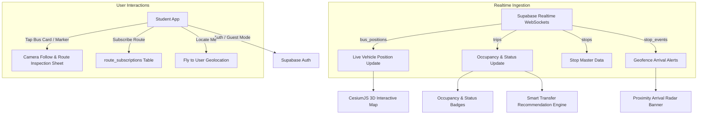

# College Bus Student App 🎓🚍

A real-time college bus transit tracker, interactive 3D satellite visualization, and occupancy monitoring application built with **Flutter**, **Supabase Realtime**, and **CesiumJS 3D**.

This app enables college students to track active buses in real-time, view live passenger occupancy, monitor delays and stop arrival alerts, lock the camera to follow vehicles along their routes, subscribe to route notifications, and receive smart bus transfer recommendations.

---

## 📋 Table of Contents
- [Overview & Architecture](#-overview--architecture)
- [Key Features](#-key-features)
- [Tech Stack & Dependencies](#-tech-stack--dependencies)
- [Database & Realtime Subscriptions](#-database--realtime-subscriptions)
- [Android Configuration & Permissions](#-android-configuration--permissions)
- [Environment Variables](#-environment-variables)
- [Getting Started & Installation](#-getting-started--installation)
- [Application Flow & Usage](#-application-flow--usage)

---

## 🌐 Overview & Architecture

The Student App acts as the real-time transit consumer interface. It connects directly to Supabase via WebSockets (Postgres Change Subscriptions) to reflect live vehicle coordinates, crowd levels, and stop events without polling.



---

## ✨ Key Features

1. **Live 3D Globe & Satellite Tracking**:
   - Interactive high-performance CesiumJS digital globe embedded in an Android WebView (`webview_flutter`).
   - Supports 3D elevation, smooth camera movements, and multi-tier satellite tiles (Cesium Ion World Imagery, Bing Maps Aerial Asset 2, or ArcGIS World Imagery fallback).
   - Rendered route stops and custom live animated bus markers color-coded by operational status:
     - 🟣 **Indigo** / 🟢 **Green**: On Time / At Stop
     - 🔴 **Red**: Running Late
     - 🟠 **Amber**: Stopped

2. **Supabase Realtime WebSocket Sync**:
   - Zero-polling architecture: Listens directly to Postgres changes on `bus_positions`, `trips`, and `stop_events`.
   - Bus markers move smoothly on the map as soon as the driver's device uploads new coordinates.

3. **Live Occupancy & Capacity Monitoring**:
   - Real-time visualization of current passenger load vs. total capacity (e.g. `24/40`).
   - Automatic percentage calculation and dynamic color coding:
     - 🟢 **Green**: `< 70%` capacity (plenty of seats available)
     - 🟡 **Yellow**: `70% - 89%` capacity (moderately full)
     - 🔴 **Red**: `≥ 90%` capacity (crowded / nearing full capacity)

4. **Smart Transfer Recommendation Engine**:
   - Proactively evaluates multiple buses running on the same route.
   - When one bus reaches high crowding (`≥ 90%`) while an alternate bus has spare capacity (`≤ 50%`), the app displays an actionable recommendation banner suggesting the less crowded bus.

5. **Camera Follow ("Track on Map")**:
   - Tapping any bus card or map entity locks the camera into following mode, auto-centering the viewport as the bus travels.
   - Includes a floating **"Stop Tracking"** badge to easily unlock camera control.

6. **Route & Stop Inspection Bottom Sheet**:
   - Expandable modal sheet showing:
     - Bus identification, assigned route name, live delay status.
     - Distance and proximity text relative to the nearest stop (e.g. `"Near Silk Board"`, `"450 m from HSR Layout"`).
     - Full sequential timeline of all stops along the route with progress indicators highlighting stops the bus is currently approaching.
     - Waiting student counts (`members_count`) per stop.

7. **Proximity Arrival Radar Alerts**:
   - Real-time snackbar notifications trigger whenever an active bus crosses a stop's geofence boundary (`stop_events: arrived`).

8. **Route Push Notification Subscriptions**:
   - Route subscription sheet enabling students to subscribe/unsubscribe to specific routes (`route_subscriptions` table).
   - Integrates with backend triggers and Supabase Edge Functions (`send-push`) for FCM notifications on bus delays and arrivals.

9. **Flexible Authentication**:
   - Student Sign In & Sign Up with email and password.
   - Automatic creation and syncing of student profiles in the `users` table (`role = 'student'`).
   - Built-in **"Continue as Guest (Demo)"** mode for rapid testing without authentication barriers.

---

## 🛠 Tech Stack & Dependencies

| Layer | Technology | Purpose |
|---|---|---|
| **Framework** | Flutter (Dart SDK `^3.11.1`) | Cross-platform UI development |
| **Backend & Realtime** | Supabase (`supabase_flutter: ^2.17.1`) | Auth, PostgreSQL database, Realtime WebSocket replication |
| **Mapping Engine** | CesiumJS 1.119 via `webview_flutter: ^4.10.0` | 3D satellite digital globe & vector entity rendering |
| **User Geolocation** | `geolocator: ^14.0.3` | Center camera on student's current location |
| **Environment** | `flutter_dotenv: ^6.0.1` | Environment variable management |

---

## 🗄 Database & Realtime Subscriptions

The Student App listens to and queries the following database tables:

- **`trips`**: Filters active trips (`status = 'in_progress'`), reads `running_status`, `current_occupancy`, and relations to `buses` and `routes`.
- **`bus_positions`**: Realtime subscription updating vehicle lat/lon coordinates.
- **`stops`**: Loads route stops, geographic coordinates, sequence numbers, and waiting passenger metrics.
- **`stop_events`**: Realtime subscription listening for geofence arrivals (`arrived`) to present immediate alerts.
- **`route_subscriptions`**: Stores student subscriptions to specific transit corridors.

---

## 📱 Android Configuration & Permissions

Defined in `android/app/src/main/AndroidManifest.xml`:

```xml
<uses-permission android:name="android.permission.INTERNET"/>
<uses-permission android:name="android.permission.ACCESS_FINE_LOCATION"/>
<uses-permission android:name="android.permission.ACCESS_COARSE_LOCATION"/>
```

In the `<activity>` tag:
```xml
android:hardwareAccelerated="true"
```

---

## 🔐 Environment Variables

Create or update `.env` in the root of `student_app/` (declared in `pubspec.yaml` under `assets`):

```env
Api_url=https://YOUR_SUPABASE_PROJECT_ID.supabase.co
Anon_key=YOUR_SUPABASE_ANON_KEY
CESIUM_ION_ACCESS_TOKEN=YOUR_CESIUM_ION_ACCESS_TOKEN
```

> **Note**: If `CESIUM_ION_ACCESS_TOKEN` is blank or invalid, the map automatically falls back to public ArcGIS World Imagery.

---

## 🚀 Getting Started & Installation

### Prerequisites
- [Flutter SDK](https://docs.flutter.dev/get-started/install) (version 3.11.1 or higher)
- Android Studio / Android SDK (API level 34 recommended)
- Running Supabase project with `schema.sql`, `seed_data.sql`, and `update_schema.sql` applied

### Installation Steps

1. Navigate to the student app directory:
   ```bash
   cd student_app
   ```

2. Install packages:
   ```bash
   flutter pub get
   ```

3. Ensure `.env` is configured:
   - Check that `student_app/.env` contains valid credentials.
   - Confirm `student_app/web/cesium/map.html` exists.

4. Launch the application on an Android device or emulator:
   ```bash
   flutter run
   ```

---

## 🔄 Application Flow & Usage

1. **Accessing the App**:
   - Sign in with student credentials, create an account, or tap **"Continue as Guest (Demo)"**.
2. **Main Live Map**:
   - The app loads active trips and positions, rendering Bangalore college routes and 3D terrain.
   - Active buses appear on the bottom horizontal card scroll and as markers on the map.
3. **Locating Yourself**:
   - Tap the purple GPS button in the lower-right corner to zoom directly to your current location.
4. **Tracking a Bus**:
   - Tap any bus card at the bottom or click a bus on the map.
   - Tap **"Track on Map"** to lock the camera to that bus.
   - Scroll up on the bottom sheet to inspect all stops, distances, and waiting student numbers.
5. **Route Notifications**:
   - Tap the bell icon in the top header to subscribe to your route (e.g. Route A, Route B, Route C).
6. **Smart Recommendations**:
   - If an active bus on your route becomes overcrowded, look for the orange suggestion banner at the top recommending an alternate bus.
